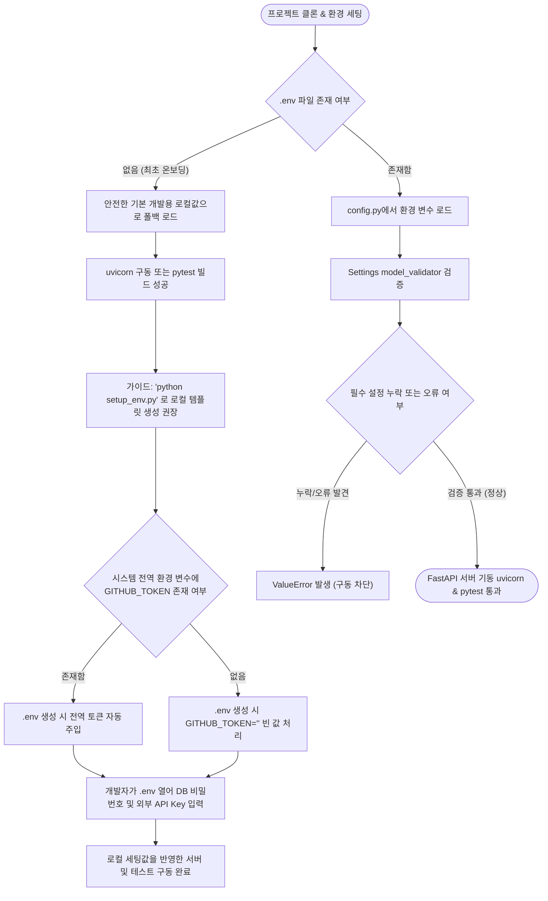

# 💻 Getting Started (서버 실행 가이드)

프로젝트를 처음 클론(Clone) 받은 후, 백엔드 및 프론트엔드의 구동 환경을 빠르게 세팅하기 위해 아래의 **OS별 온보딩 자동화 스크립트**를 실행해 주세요. 개발 도구와 라이브러리가 갖춰지지 않은 최소 환경에서도 필요한 패키지를 진단 및 자동 설치하여 준비해 줍니다.

---

## ⚡ 1분 만에 개발 환경 세팅 완료하기 (자동화 셋업)

터미널을 열고 프로젝트 루트 폴더에서 본인의 운영체제에 맞는 단 하나의 명령어를 복사하여 실행해 주세요.

### 🪟 Windows (PowerShell)
PowerShell 창을 열어 프로젝트 루트 폴더로 이동한 뒤 아래 명령어를 실행합니다:
```powershell
Set-ExecutionPolicy Bypass -Scope Process; .\scripts\setup_win.ps1
```

### 🍎 macOS
터미널을 열어 프로젝트 루트 폴더로 이동한 뒤 아래 명령어를 실행합니다:
```bash
chmod +x scripts/setup_mac.sh && ./scripts/setup_mac.sh
```

### 🐧 Linux (Ubuntu/Debian 계열)
터미널을 열어 프로젝트 루트 폴더로 이동한 뒤 아래 명령어를 실행합니다:
```bash
chmod +x scripts/setup_linux.sh && ./scripts/setup_linux.sh
```

> [!NOTE]
> **자동 셋업 수행 내용**: 
> - 누락된 핵심 도구(Python 3.12, Node.js, mkcert)의 자동 설치 (winget, brew, apt-get 활용)
> - 로컬 CA 신뢰 구축 및 백엔드 로컬 SSL 인증서 자동 발급 (`backend/certs/`)
> - 글로벌 패키지 매니저 `pnpm` 설치 및 프론트엔드 모듈 설치 (`pnpm install`)
> - 백엔드 가상환경(`venv`) 생성, 활성화 및 의존성 패키지 설치 (`requirements.txt`)
> - 환경 변수 `.env` 파일 템플릿 자동 구성 (`setup_env.py` 연동)
> 
> 스크립트 구동이 완료된 후에는 화면 안내 가이드에 따라 **1) 로컬 DB Docker 컨테이너 실행 확인**, **2) backend/.env 파일 내 OpenAI API Key 등 개인 세팅 입력**을 완료한 뒤 즉시 백엔드/프론트엔드 서버를 구동하실 수 있습니다.

---

## 🛠️ 수동으로 직접 설치 및 설정하기

자동화 스크립트를 사용하지 않고 각 단계를 직접 하나씩 수동으로 세팅하고 구동하고 싶다면 아래 가이드를 순서대로 수행해 주세요.

---


## 0. 로컬 SSL 인증서 발급 (`mkcert` 세팅)
웹 API 보안 정책(예: 쿠키 전송, 소셜 로그인 등)을 로컬에서 정상적으로 테스트하기 위해, 프론트엔드와 백엔드 모두 `HTTPS` 통신을 기본으로 합니다. 이를 위해 로컬 인증서를 발급받아야 합니다.

```bash
# 1. mkcert 설치 (운영체제에 맞게 선택)
# [Windows]
choco install mkcert
# [Mac]
brew install mkcert
# [Linux / Ubuntu]
sudo apt update
sudo apt install libnss3-tools mkcert

# (만약 apt에서 mkcert를 찾을 수 없는 옛날/경량 버전의 Ubuntu라면 수동 설치)
# sudo apt install libnss3-tools
# wget -O mkcert https://dl.filippo.io/mkcert/latest?for=linux/amd64
# chmod +x mkcert
# sudo mv mkcert /usr/local/bin/

# 2. 로컬 인증기관(CA) 설치
mkcert -install

# 3. 백엔드 폴더 내에 인증서 폴더 생성 및 발급
mkdir -p backend/certs
cd backend/certs
mkcert localhost 127.0.0.1
```
> 위 명령어를 실행하면 `backend/certs/` 폴더 내부에 `localhost.pem` (인증서)과 `localhost-key.pem` (개인키) 파일이 생성됩니다.

---

## 1. Backend (FastAPI) 구동 세팅
백엔드는 파이썬 3.12 가상환경(Virtual Environment) 위에서 구동합니다.

```bash
# 1. 백엔드 폴더로 이동
cd backend

# 2. 파이썬 가상환경 생성 (최초 1회만 실행)
python -m venv venv

# 3. 가상환경 활성화
# - Windows (PowerShell):
.\venv\Scripts\Activate.ps1
# - Mac/Linux:
source venv/bin/activate

# 4. 필수 라이브러리 설치
pip install -r requirements.txt
```

### 1.1. 환경 변수(.env) 설정

> [!NOTE]
> **안전한 로컬/CI 환경용 기본값(Fallback) 탑재**: 본 백엔드 설정(`config.py`)은 로컬 개발 환경 및 CI 테스트 빌드가 편리하도록 보안상 문제가 없는 안전한 기본 개발용 로컬 폴백값을 기본 제공합니다. 따라서 로컬 기동 및 단순 단위 테스트 구동 목적이라면 별도의 `.env` 파일 구성이 없는 기동 시점에도 에러(ValueError)를 발생시키지 않고 기본 동작(테스트 통과 및 서버 초기 설정 완료)을 지원합니다.
> - `DB_USER`: `"postgres"`, `DB_HOST`: `"localhost"`, `DB_PORT`: `5432`, `DB_NAME`: `"codemap_db"`
> - `CLONE_BASE_DIR`을 비워둘 경우 OS(Windows/Unix)를 자동 인식하여 `C:/temp/codemap/jobs` 또는 `/tmp/codemap/jobs`로 매핑됩니다.

> [!CAUTION]
> - **보안 권장 사항 및 실제 연동**: 로컬 튜토리얼용 기본값 외에 실제 데이터베이스 접속 정보, OpenAI API Key, GitHub Token(Rate Limit 방지용 PAT) 등을 사용해 전체 비즈니스 파이프라인을 온전하게 구동하기 위해서는 **반드시 `.env` 파일에 개발자 개인의 세팅 정보를 기록하여 사용해야 합니다.** 아래 스크립트를 사용해 편리하게 초기 템플릿 환경을 구성하십시오.

#### ⚙️ 로컬 환경 변수 온보딩 및 구동 흐름도



> [!NOTE]
> **전역 GITHUB_TOKEN 자동 연동 및 특이 케이스 배제**: `setup_env.py` 실행 시 시스템 환경 변수에 이미 GITHUB_TOKEN이 지정되어 있다면 해당 값을 감지하여 `.env` 생성 시 자동으로 주입(백필)해 줍니다. 단, 로컬에 다른 필수 설정(DB 접속 정보 등)이 전혀 없는데 오직 `GITHUB_TOKEN`만 시스템 환경 변수나 기존 파일에 단독으로 선언되어 있는 특이 케이스는 실질적인 정상 개발 환경으로 보지 않으며 본 구동 흐름 및 스크립트 분기에서 별도로 고려하지 않습니다. 이러한 특이 상태에서는 기존 파일을 정리한 후 스크립트를 재실행해야 합니다.

현재 백엔드 코드(`config.py`)는 로컬 구동 시 안전한 기본값으로 폴백되도록 설계되어 있습니다. 다만, 보안성 극대화 및 실제 외부 연동(데이터베이스 접속, OpenAI API 등), 그리고 개인 환경 설정을 위해서는 백엔드 디렉토리 하위에 `.env` 파일을 구성해 주시는 것이 권장됩니다.

#### 🛠️ 자동 생성 스크립트를 통한 구성
백엔드 폴더(`backend/`) 내에 제공되는 `setup_env.py` 스크립트를 실행하면 튜토리얼용 기본값과 필수 키 뼈대가 포함된 `.env` 파일이 자동으로 생성됩니다.
```bash
# 가상환경이 활성화된 상태에서 실행
python setup_env.py
```

#### 📍 로컬용 `.env` 파일 구성 템플릿 (`backend/.env`)
```env
# 1. 데이터베이스 접속 상세 정보 (로컬 튜토리얼용 설정)
DB_USER=postgres
DB_PASSWORD=""
DB_HOST=localhost
DB_PORT=5432
DB_NAME=codemap_db

# 2. 데이터베이스 연결 URL (DATABASE_URL 생략 시 위 접속 정보들로 동적 조립됨)
DATABASE_URL=

# 3. 임시 파일 다운로드 경로 (비워두면 아래의 OS별 설정값이 자동 로드됨)
CLONE_BASE_DIR=
CLONE_BASE_DIR_WINDOWS=C:/temp/codemap/jobs
CLONE_BASE_DIR_UNIX=/tmp/codemap/jobs

# 4. 외부 서비스 API 키 설정
OPENAI_API_KEY=""
OPENAI_MODEL=gpt-4o-mini
GITHUB_TOKEN=""

# 5. 애플리케이션 실행 모드
DEBUG=True

# 6. RAG 임베딩 설정 (기본 임베딩 스펙 정의)
EMBEDDING_MODEL=text-embedding-3-large
EMBEDDING_DIMENSIONS=1536
EMBEDDING_BATCH_SIZE=100
EMBEDDING_MAX_RETRIES=3

```

> [!IMPORTANT]
> - `CLONE_BASE_DIR` 값을 비워두면(`""`), 구동 중인 OS 환경을 스스로 판별하여 Windows인 경우 `CLONE_BASE_DIR_WINDOWS` 값을, Unix/Linux인 경우 `CLONE_BASE_DIR_UNIX` 값을 자동으로 채워 구동합니다.
> - **커스텀 경로 설정 가이드**: 기본 로컬/테스트 구동 시에는 안전한 로컬 기본값으로 동작합니다. 단, 운영 환경이나 특정 목적에 따라 다른 클론 임시 경로를 사용하고 싶다면, 해당 OS에 맞는 `CLONE_BASE_DIR_WINDOWS` 혹은 `CLONE_BASE_DIR_UNIX`를 `.env` 파일에 명시적으로 설정하여 오버라이드할 수 있습니다.
> - `DB_PASSWORD`, `GITHUB_TOKEN`, `OPENAI_API_KEY`와 같은 보안 필수값은 스크립트를 통해 생성된 후 반드시 개발자 본인의 로컬 환경 세팅값으로 알맞게 편집해 채우셔야 합니다. GITHUB_TOKEN은 GitHub API의 Rate Limit을 예방하기 위해 발급 후 입력을 강력 권장합니다.

# 5. FastAPI 서버 실행 (HTTPS 적용)
```bash
uvicorn app.main:app --reload --ssl-keyfile certs/localhost-key.pem --ssl-certfile certs/localhost.pem
```
> 정상 실행 시 `https://localhost:8000` 으로 서버가 열립니다.

---

## 2. Frontend (Next.js) 구동 세팅
프론트엔드는 Node.js 20.9 이상 및 Next.js 16, React 19가 사용됩니다.

```bash
# 1. 프론트엔드 폴더로 이동
cd frontend

# 2. 필수 라이브러리(node_modules) 설치
pnpm install

# 3. Next.js 개발 서버 실행 (HTTPS 적용)
pnpm dev -- --experimental-https --experimental-https-key ../backend/certs/localhost-key.pem --experimental-https-cert ../backend/certs/localhost.pem
```
> 정상 실행 시 `https://localhost:3000` 으로 서버가 열립니다.
> 만약 윈도우 환경에서 `localhost` 인증서 문제나 권한 문제가 있다면, 브라우저에서 안전하지 않음으로 이동을 클릭하여 신뢰를 허용해 주십시오.

---

## 3. HTTPS 통신 구성 (CORS 및 API 연결)
로컬 환경에서 프론트엔드(`https://localhost:3000`)와 백엔드(`https://localhost:8000`)가 통신하기 위한 필수 설정입니다.

### 🛡️ 백엔드: CORS 설정 (main.py)
```python
from fastapi import FastAPI
from fastapi.middleware.cors import CORSMiddleware

app = FastAPI()

app.add_middleware(
    CORSMiddleware,
    allow_origins=["https://localhost:3000"],  # 프론트엔드의 HTTPS 주소 허용
    allow_credentials=True,
    allow_methods=["*"],
    allow_headers=["*"],
)
```

### 🌐 프론트엔드: 백엔드 API URL 환경 변수 세팅
Next.js는 `next.config.ts`의 `rewrites`를 통해 클라이언트의 `/api` 요청을 백엔드로 프록시 전달합니다.
이를 위해 `.env` 파일에 백엔드 주소를 지정해 줍니다.

```text
# frontend/.env
BACKEND_URL=https://localhost:8000
```

---

## 4. 데이터베이스(PostgreSQL) 사용 가이드

프로젝트는 이제 **하나의 스키마**로 기존 분석 파이프라인 테이블과 새 RAG(검색‑증강) 테이블을 모두 포함합니다.

### 4.1. 테이블 구조 개요
| 테이블 | 목적 |
|-------|---------|
| `analysis_jobs` | 레포지토리 분석 작업의 상태·진행 상황을 추적 |
| `source_files`   | 원본 소스 파일 레코드 – 레거시(호환성 유지) |
| `code_chunks`    | 텍스트‑청크 임베딩 – 레거시 |
| `file_dependencies` | 레거시 파일‑의존성 메타데이터 |
| `users`          | 애플리케이션 사용자 (이메일, 비밀번호 해시, 이름) |
| `repositories`   | 사용자가 소유한 레포지토리 (`user_id` FK) |
| `code_nodes`     | 파일/폴더 계층 구조 + RAG 임베딩 |
| `dependencies`   | `code_nodes` 사이의 다대다 import‑dependency 그래프 |

 모든 테이블은 **`public`** 스키마에 속하며, 서비스 계정 **`codemap_service`** 로 `SELECT/INSERT/UPDATE/DELETE` 전체 권한을 가집니다.

> [!WARNING]
> 로컬 환경이 아닌 원격 공유 개발 DB 및 실서비스 운영 환경에서는 기본 계정(`codemap_service:codemap`)을 절대 그대로 사용하지 마십시오. 반드시 `.env` 파일에 강력한 비밀번호를 지정하고, 데이터베이스 역할 권한을 최소화하여 덮어써야 합니다.

---

### 4.2. 사전 준비
| 도구 | 준비 및 설치 방법 |
|------|-----------------|
| **psql** (PostgreSQL 클라이언트) | `sudo apt-get install postgresql-client` (Linux) 또는 Windows 설치 프로그램 다운로드 |
| **pgAdmin** (GUI) | <https://www.pgadmin.org/download/> 에서 다운로드 |
| **Python 3.12+** | 백엔드 `venv` 에 이미 포함 |
| **백엔드 의존성 패키지** | `SQLAlchemy` 및 비동기 드라이버(`asyncpg`) 등 필수 패키지는 백엔드 가상환경 활성화 후 `pip install -r requirements.txt` 명령어로 일괄 설치합니다. |

---

### 4.3. pgAdmin으로 연결하기
1. **pgAdmin** 실행 → *Add New Server* 클릭
2. **General** → Name: `CodeMap Remote`
3. **Connection** →
   - Host name/address: `<HOST>`
   - Port: `<PORT>`
   - Maintenance database: `<DB_NAME>`
   - Username: `codemap_service`
   - Password: `<DB_PASSWORD>`
   - Save password: ✅
4. **Save** 클릭. 트리 구조에 `public` 스키마와 위 테이블들이 표시됩니다.

---

### 4.4. `psql`로 연결하기
```bash
psql -h <HOST> -p <PORT> -d <DB_NAME> -U codemap_service
Password: <DB_PASSWORD>
```
연결 후 일반 SQL을 실행할 수 있습니다.
```sql
\dt               -- 테이블 목록
SELECT * FROM users LIMIT 5;
INSERT INTO repositories (user_id, url) VALUES ('<USER_UUID>', 'https://github.com/example/repo');
```

---

### 4.5. Python ORM (SQLAlchemy) 사용법 (비동기 AsyncSession)
프로젝트는 FastAPI의 비동기 실행 흐름에 맞춰 **SQLAlchemy 비동기 엔진(postgresql+asyncpg)**과 **`AsyncSession`**을 사용합니다.
모델 선언 및 세션 설정은 다음 파일들을 참고하세요:
* **모델**: `backend/app/repo/models.py`
* **DB 설정 및 세션 팩토리**: `backend/app/infra/database.py`

#### CRUD 및 조회 비동기 예시
```python
from sqlalchemy import select
from sqlalchemy.ext.asyncio import AsyncSession
from app.infra.database import async_session_factory
from app.repo.models import User, Repository, CodeNode, Dependency

async def database_operations():
    # 비동기 세션 팩토리를 통해 세션 획득
    async with async_session_factory() as session:
        # 1️⃣ 사용자 생성
        new_user = User(email='alice@example.com', password_hash='<bcrypt-hash>', name='Alice')
        session.add(new_user)
        await session.commit()
        await session.refresh(new_user)

        # 2️⃣ 해당 사용자의 레포지토리 생성
        repo = Repository(user_id=new_user.id, url='https://github.com/alice/project', branch='main')
        session.add(repo)
        await session.commit()
        await session.refresh(repo)

        # 3️⃣ 파일 노드 삽입 (레포지토리 내 파이썬 파일)
        node = CodeNode(
            repo_id=repo.id,
            parent_id=None,               # 루트 디렉터리
            path='src/main.py',
            type='FILE',
            depth=1,
            content='print("Hello")',
            summary='간단한 Hello 스크립트',
            embedding=None,               # 추후 벡터 저장
        )
        session.add(node)
        await session.commit()

        # 4️⃣ 의존성 생성 (node 가 다른 node 를 import)
        dep = Dependency(source_id=node.id, target_id=target_node_id, type='import')
        session.add(dep)
        await session.commit()

        # 5️⃣ 사용자가 소유한 모든 레포지토리 비동기 조회
        result = await session.execute(
            select(Repository).where(Repository.user_id == new_user.id)
        )
        repos = result.scalars().all()

        # 6️⃣ 특정 모듈(node)을 import 하는 모든 파일 찾기
        result = await session.execute(
            select(Dependency)
            .join(CodeNode, Dependency.source_id == CodeNode.id)
            .where(Dependency.target_id == target_node_id)
        )
        imports = result.scalars().all()
```

> **참고**: FastAPI 라우터 환경에서는 직접 세션을 팩토리에서 열지 않고 `db: AsyncSession = Depends(get_db)` 의존성 주입을 통해 컨텍스트 내부 세션을 받아 비동기 쿼리를 수행합니다.

---

### 4.6. DB 초기화 스크립트 실행 (다시 구축할 때)
DDL 파일은 `database/init.sql` 에 있습니다. 새 DB에 적용하려면 다음과 같이 실행합니다.
```bash
# 관리자 계정(`<ADMIN_USER>`) 사용 – CREATE 권한 보유
psql -h <HOST> -p <PORT> -d <DB_NAME> -U <ADMIN_USER> -f database/init.sql
```
스크립트 내용:
1. `vector` 확장 활성화
2. **전체 테이블**(레거시 + 신규) 생성
3. 서비스 역할 `codemap_service` (비밀번호 `codemap`) 생성
4. `public` 스키마에 대해 역할에 전체 DML 권한 부여 및 향후 테이블에 대한 기본 권한 설정

> **주의**: 서비스 역할은 확장이나 역할을 만들 수 없습니다. 구조 변경이 필요하면 관리자(``<ADMIN_USER>``) 계정으로 수행하세요.

---

### 4.7. 보안·유지보수 팁
* **비밀번호 교체** – 정기적으로 서비스 비밀번호를 바꾸세요:
```sql
ALTER ROLE codemap_service WITH PASSWORD '<NEW_PASSWORD>';
```
* **최소 권한** – 읽기 전용 API가 필요하면 서비스 역할을 복제하고 `INSERT/UPDATE/DELETE` 를 회수합니다.
* **백업** – 매일 `pg_dump` 로 `<DB_NAME>` DB 를 백업합니다:
```bash
pg_dump -h <HOST> -p <PORT> -U <ADMIN_USER> -F c -b -v -f <DB_NAME>_backup.dump <DB_NAME>
```
* **마이그레이션** – 프로젝트에 Alembic 이 포함되어 있습니다. 사용 예:
```bash
alembic init alembic
# alembic.ini 에 원격 DB URL 지정
alembic revision --autogenerate -m "Add new column"
alembic upgrade head
```
