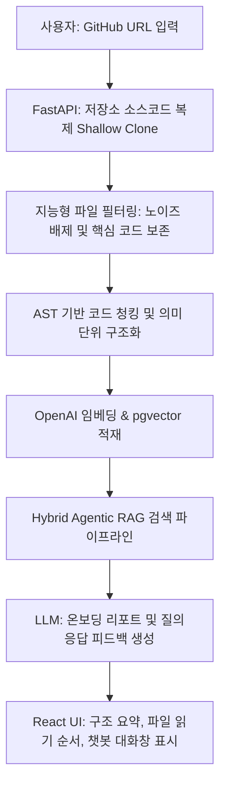

# 🚀 프로젝트 개요 및 배경 (Project Context)

GitHub 저장소(Repository) URL을 입력하면 README, 폴더 구조, 핵심 파일, 실행 방법, 처음 읽을 순서를 분석해서 **"신입 개발자용 온보딩 문서"를 자동 생성**하는 FastAPI + React 기반 LLM 웹앱, **CodeMap** 프로젝트의 개요 및 배경입니다.

---

## 1. 프로젝트 개요 (Overview)

| 항목 | 내용 |
| :--- | :--- |
| **프로젝트명** | **CodeMap** (최종 채택안) |
| **핵심 콘셉트** | 처음 분석하는 GitHub 저장소를 빠르게 이해하도록 전체 구조 분석, 핵심 파일 추천, 실행 가이드 및 요약 아키텍처 제공 |
| **타깃 사용자** | 신입 개발자, 팀 프로젝트 협업 개발자, 오픈소스 기여자 |
| **핵심 기술 스택** | Python 3.12 (FastAPI), React 19, PostgreSQL (pgvector), OpenAI (gpt-4o, text-embedding-3-large, gpt-4o-mini) |

---

## 2. 문제 정의 — 왜 필요한가 (Problem Definition)

* **온보딩 장벽**: 처음 분석을 시도하는 코드베이스는 `README.md`만으로 전반적인 의존성과 설계 흐름을 유추하기 어렵습니다.
* **시간 소모**: 새로운 팀에 들어왔을 때 "어떤 모듈 파일부터 분석해야 하는지", "어떻게 빌드하고 로컬 환경을 실행하는지", "핵심 비즈니스 로직의 진입점이 어디인지" 추적하는 데 상당한 개발 리소스와 시간이 소요됩니다.
* **챗봇의 한계**: 기존의 일반적인 코드 Q&A 챗봇은 단순히 특정 코드 조각만 가져오므로, 프로젝트 전반의 큰 흐름(Architecture)을 통합적으로 제공하지 못합니다.
* **해결책**: 단순 질의응답을 넘어, 코드베이스 분석 결과와 RAG 파이프라인을 융합하여 온보딩용 아키텍처 마스터 리포트를 자동 생성합니다.

---

## 3. 핵심 기능 (Key Highlights)

1. **GitHub URL 입력 연동**: public repo URL만 입력하면 서버가 실시간으로 소스코드를 복제하고 정제(필터링)하여 분석을 준비합니다.
2. **프로젝트 구조 요약**: Backend, Frontend, Config, Test 등 핵심 영역별로 파일과 디렉토리 역할을 자동 분류합니다.
3. **핵심 파일 및 읽기 순서 추천**: 의존성 분석을 수행하여 개발자가 가장 먼저 분석을 시작해야 할 핵심 엔트리포인트를 10개 내외로 식별하고 읽는 순서를 제시합니다.
4. **로컬 실행 가이드 추론**: `package.json`, `requirements.txt`, `docker-compose.yml` 등을 지능적으로 추출하여 패키지 설치 및 구동 명령어를 가이드합니다.
5. **저장소 기반 자연어 대화**: "로그인 라우터가 정의된 곳이 어디야?", "어떤 데이터베이스 테이블을 사용해?" 등의 질문에 출처 파일 및 줄 번호를 동반한 정밀한 답변을 제공합니다.

---

## 4. 시스템 아키텍처 개요 (System Architecture)



---

## 5. 프로젝트 디렉토리 구조 (Monorepo)

본 프로젝트는 도메인 주도 설계(DDD) 및 FSD 아키텍처를 도입하여 복잡성을 최소화했습니다.

```plain text
CodeMap/
├── frontend/                 # Next.js 16 + React 19 (FSD & Bulletproof)
│   ├── src/
│   │   ├── app/              # Next.js App Router 영역 (page.tsx, layout.tsx)
│   │   ├── common/           # 공통 UI 컴포넌트, 훅, 테마
│   │   └── features/         # 기능별 도메인 UI, API 통신, 상태 관리
│   └── next.config.ts
├── backend/                  # FastAPI - Python 3.12 (3-Tier Layer)
│   ├── app/
│   │   ├── {domain}/         # 기능 도메인 폴더 (router, service, repository, schemas, models)
│   │   └── main.py           # FastAPI 서버 진입점
│   ├── certs/                # 로컬 SSL 인증서
│   └── requirements.txt
├── database/                     # DB 스키마 설계 (init.sql)
├── scripts/                      # Docker Compose 및 인프라 실행 환경 스크립트
└── docs/                         # 시스템 설계 문서 및 팀 컨벤션 가이드
```
