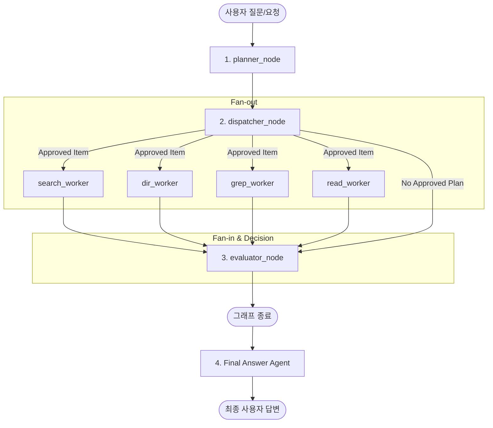
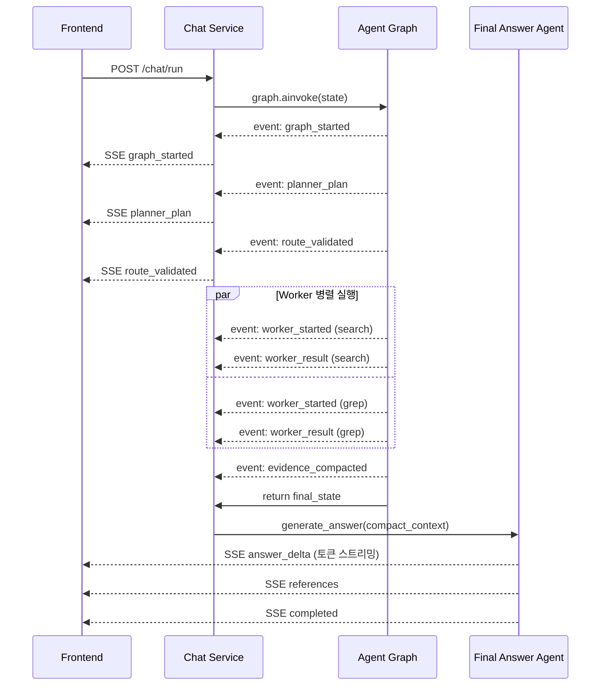

# Phase 1 Agent Graph Flow (LLM 에이전트 그래프 실행 흐름)

> **도메인**: Agent | **Phase**: 1 | **최종 업데이트**: 2026-06-25

본 문서는 CodeMap의 LLM 멀티에이전트 그래프가 사용자 질문을 받아 최종 답변을 생성하기까지의 **Phase 1 실행 흐름**을 시각화합니다.

---

## 전체 흐름도

---

## 단계별 설명

### 1. Planner Node (`planner_node`)

- **역할**: LLM 기반 계획 수립 노드
- **구현**: `backend/app/agent/nodes/planner_node.py`
- **입력**: `user_query` (사용자 원본 질문)
- **출력**: `rewritten_query` (오타 교정·의도 보정 쿼리), `access_plan` (도구 실행 계획)
- **SSE 이벤트**: `planner_plan`

### 2. Dispatcher Node (`dispatcher_node`)

- **역할**: 결정론적 보안 검증 및 Worker Fan-out
- **구현**: `backend/app/agent/nodes/dispatcher_node.py`
- **처리**: Planner의 `access_plan`을 받아 경로 보안 검증(allowlist) 후, 승인된 항목을 병렬로 Worker에 분배
- **SSE 이벤트**: `route_validated`

### 3. Workers (Tool Adapters)

| Worker | 구현 | 역할 |
| --- | --- | --- |
| `search_worker` | `workers/search_worker.py` | 시맨틱 벡터 검색 (Hybrid Search + RRF) |
| `dir_worker` | `workers/dir_worker.py` | 디렉토리 구조 스캔 |
| `grep_worker` | `workers/grep_worker.py` | 패턴 기반 코드 검색 |
| `read_worker` | `workers/read_worker.py` | 파일 내용 읽기 |

- **SSE 이벤트**: `worker_started`, `worker_result`

### 4. Evaluator Node (`evaluator_node`)

- **역할**: 수집된 근거(evidence) 압축 및 충분성 평가
- **구현**: `backend/app/agent/nodes/evaluator_node.py`
- **Phase 1**: 근거 압축(`compact_context`) 후 그래프 종료
- **Phase 2 (예정)**: 근거 부족 시 `re-plan` → Planner 재진입 루프
- **SSE 이벤트**: `evidence_compacted`

### 5. Final Answer Agent

- **역할**: 그래프 밖에서 최종 답변을 정제·스트리밍
- **구현**: `backend/app/chat/final_answer_agent.py`
- **처리**: Evaluator가 만든 `compact_context`와 원본 근거를 기반으로 사용자에게 마크다운 형태의 답변을 SSE 스트리밍
- **SSE 이벤트**: `answer_delta`, `content`, `references`, `completed`

---

## SSE 이벤트 타임라인

---

## 관련 문서

- [ARCHITECTURE.md](./ARCHITECTURE.md) — 전체 프로젝트 폴더 구조
- [AGENTIC_RAG_ARCHITECTURE.md](./AGENTIC_RAG_ARCHITECTURE.md) — Agentic RAG 설계 논의
- [LLM_AGENT_SPEC.md](../03_Specifications/03_LLM/spec/LLM_AGENT_SPEC.md) — Agent 도메인 SSOT 명세서
- [LLM_PLANNER_SPEC.md](../03_Specifications/03_LLM/spec/LLM_PLANNER_SPEC.md) — Planner Node 명세서
