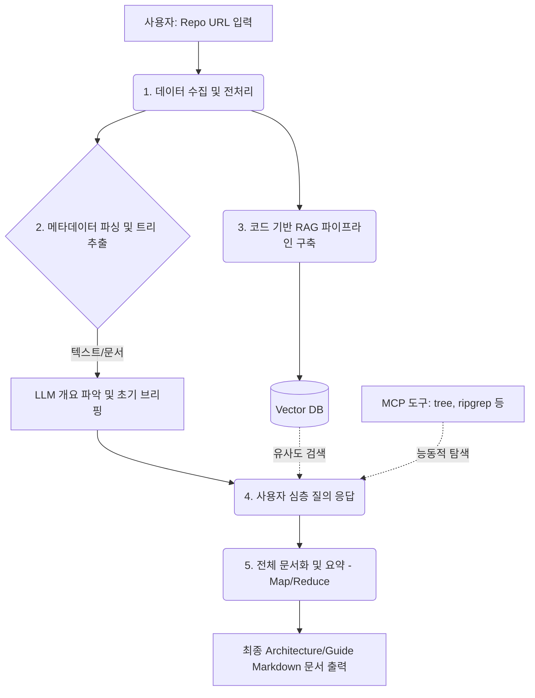

# GitHub Repo Analysis Chatbot Workflow

> [!NOTE]
> 본 문서는 GitHub 레포지토리의 구조와 개요를 분석하고, 심층적인 질의응답 및 최종 문서화까지 수행하는 **Agentic RAG 기반 챗봇**의 작업 흐름(Workflow)과 역할 분담 가이드를 정리한 아티팩트입니다.

## 🏗️ 전체 시스템 아키텍처 (Workflow)

## 👩‍💻 단계별 상세 가이드 및 팀원 역할 분담

### 파트 1: 데이터 수집 및 전처리 (Data Acquisition & Preprocessing)
사용자가 입력한 URL로부터 불필요한 데이터 없이 순수한 코드와 핵심 문서만 서버로 가져옵니다.

* **핵심 작업**:
  * `Git Shallow Clone (--depth 1)`을 통한 최소한의 코드 다운로드
  * `.gitignore` 파싱을 통한 분석 불필요 파일(`node_modules`, `.git`, `venv` 등) 사전 필터링
  * `package.json`, `requirements.txt`, `Dockerfile` 등 환경 구성 메타데이터 파일 우선 추출
* **목표**: LLM이 분석할 '노이즈 없는' 청정 데이터셋 확보

### 파트 2: RAG 및 벡터 데이터베이스 구축 (Code Embedding & RAG)
방대한 코드를 쪼개어 AI가 필요한 부분만 빠르게 검색할 수 있도록 데이터베이스화합니다.

* **핵심 작업**:
  * **Code-aware Chunking**: 단순 텍스트 분할이 아닌 함수, 클래스, 메서드 단위로 의미를 훼손하지 않고 코드 분할
  * **임베딩 (Embedding)**: 코드의 의미를 벡터(숫자 배열)로 변환
  * **벡터 DB 저장**: ChromaDB, FAISS 등을 활용해 변환된 벡터와 메타데이터(원본 파일 경로, 라인 넘버)를 저장
* **목표**: 사용자의 자연어 질문을 정확한 소스 코드 검색으로 연결하는 지식 기반(Retrieval) 시스템 구축

### 파트 3: LLM 에이전트 및 MCP 연동 (Agent & Tool Calling)
AI가 단순히 주어진 텍스트만 읽는 것을 넘어, 직접 시스템 도구를 다루며 능동적으로 코드를 탐색하게 만듭니다.

> [!IMPORTANT]
> 이 시스템의 지능(Brain)을 담당하는 가장 핵심적인 파트입니다. 질문의 의도에 따라 RAG를 통해 유사도를 검색할지, MCP 도구를 통해 파일 시스템을 정밀하게 뒤질지 AI가 스스로 판단하게 만들어야 합니다.

* **핵심 작업**:
  * **MCP (Model Context Protocol)** 구축: AI가 서버의 파일 시스템 읽기, `tree`, `grep` 등의 명령어를 사용할 수 있도록 인터페이스 제공
  * **LLM Tool/Function Calling**: 프롬프트 엔지니어링을 통해 AI에게 도구 사용법 및 판단 로직 숙지
  * **하이브리드 탐색**: RAG(의미론적 검색)와 MCP(정밀 텍스트 검색)를 혼합하여 환각(Hallucination) 방지
* **목표**: 자율적으로 코드를 파헤치고 답을 찾아내는 능동형 Agentic 시스템 완성

### 파트 4: 문서화 및 UX 아키텍처 (Map-Reduce & Progress UX)
분석된 정보들을 모아 최종 산출물(Markdown 문서)로 깔끔하게 엮어내고 사용성을 높입니다.

> [!TIP]
> 코드가 방대할 경우 전체 코드를 한 번에 요약하려 하면 LLM 토큰 한계로 인해 내용이 누락되거나 에러가 날 수 있습니다. 분할 정복(Map-Reduce) 기법이 필수적입니다.

* **핵심 작업**:
  * **Map-Reduce 요약 체인**: 개별 폴더나 모듈별로 먼저 요약을 진행(Map)한 뒤, 생성된 요약 조각들을 하나로 취합하여 전체 아키텍처 문서 생성(Reduce)
  * **비동기 UX 구현**: 데이터 클론, 벡터 DB 인덱싱 등 긴 시간이 소요되는 작업 상태를 사용자에게 투명하게 보여주기(진행률 바, 스트리밍 응답 등)
* **목표**: 누락 없는 고품질의 프로젝트 분석 산출물 생성 및 쾌적한 챗봇 사용자 경험 제공
