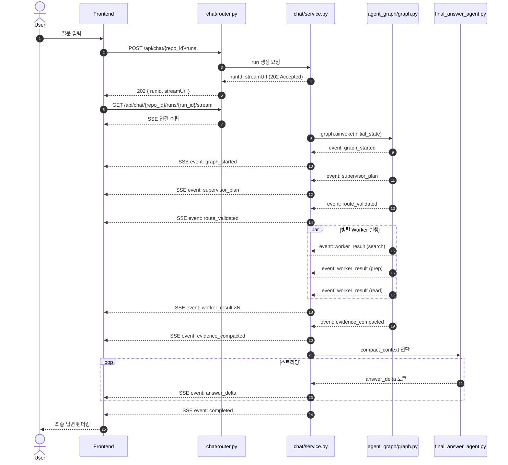
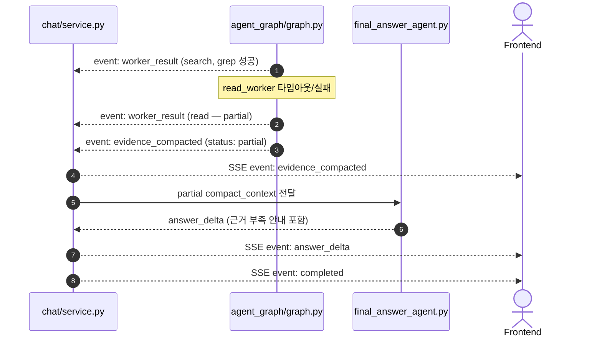

# AGENT Chat Run API 명세서

> **도메인**: AGENT | **범위**: Run Create / SSE Stream | **최종 업데이트**: 2026-06-23

## AGENT-CHAT-API-001 멀티에이전트 채팅 실행 요청

### 기본 정보

| 항목 | 값 |
| --- | --- |
| Endpoint | `POST /api/chat/{repo_id}/runs` |
| Method | POST |
| 관련 기능 ID | `AGENT-CHAT-B-101`, `AGENT-CHAT-B-201`, `AGENT-GRAPH-B-201`, `AGENT-SUPERVISOR-B-201` |
| 목적 | 사용자 질문을 받아 LangGraph 멀티에이전트 run을 생성하고 SSE stream URL을 반환 |
| 상태 | 설계 확정 / 구현 예정 |

### 요청

#### Path Parameters

| 파라미터명 | 타입 | 필수 | 설명 |
| --- | --- | --- | --- |
| `repo_id` | UUID | Y | 질문 대상 저장소 ID |

#### Request Body

| 필드명 | 타입 | 필수 | 기본값 | 설명 |
| --- | --- | --- | --- | --- |
| `question` | String | Y | - | 사용자 자연어 질문 |
| `sessionId` | UUID | N | auto | 기존 대화 세션에 이어서 질문할 때 사용 |
| `mode` | String | N | `standard` | `lite`, `standard`, `deep` |
| `includeEvidence` | Boolean | N | true | 최종 응답에 evidence metadata 포함 여부 |
| `maxToolCalls` | Integer | N | 8 | 전체 worker tool call 최대 횟수 |
| `timeoutSeconds` | Integer | N | 30 | run 전체 timeout |

#### 요청 예시

```http
POST /api/chat/8cfd0f7b-3ec3-42e3-97c4-8f4b4cc9390f/runs HTTP/1.1
Host: localhost:8000
Content-Type: application/json
Authorization: Bearer {access_token}

{
  "question": "로그인 로직 어딨어?",
  "mode": "standard",
  "includeEvidence": true,
  "maxToolCalls": 8,
  "timeoutSeconds": 30
}
```

### 응답

#### 성공 응답 - 202 Accepted

| 필드명 | 타입 | 설명 |
| --- | --- | --- |
| `code` | Integer | HTTP 상태 코드 |
| `message` | String | `accepted` |
| `data.runId` | UUID | 생성된 agent run ID |
| `data.sessionId` | UUID | 대화 세션 ID |
| `data.status` | String | `queued` 또는 `running` |
| `data.streamUrl` | String | SSE endpoint |
| `data.statusUrl` | String | 상태 조회 endpoint |
| `data.evidenceUrl` | String | evidence 조회 endpoint |

#### 응답 예시

```json
{
  "code": 202,
  "message": "accepted",
  "data": {
    "runId": "2f86a7b7-4d9b-45f1-bc5b-1c2b938c1d10",
    "sessionId": "a0de8d29-92a4-4fd6-a657-2d22f4c0cc75",
    "status": "queued",
    "streamUrl": "/api/chat/8cfd0f7b-3ec3-42e3-97c4-8f4b4cc9390f/runs/2f86a7b7-4d9b-45f1-bc5b-1c2b938c1d10/stream",
    "statusUrl": "/api/chat/8cfd0f7b-3ec3-42e3-97c4-8f4b4cc9390f/runs/2f86a7b7-4d9b-45f1-bc5b-1c2b938c1d10",
    "evidenceUrl": "/api/chat/8cfd0f7b-3ec3-42e3-97c4-8f4b4cc9390f/runs/2f86a7b7-4d9b-45f1-bc5b-1c2b938c1d10/evidence"
  }
}
```

### 에러 응답

| HTTP Status | Error Code | 발생 시점 | 설명 |
| --- | --- | --- | --- |
| 400 | `INVALID_CHAT_REQUEST` | body 검증 | 질문 누락, mode 오류, 옵션 상한 초과 |
| 401 | `UNAUTHORIZED` | 인증 검증 | 토큰 누락 또는 만료 |
| 404 | `REPO_NOT_FOUND` | repo 조회 | 저장소 없음 |
| 409 | `REPO_NOT_ANALYZED` | 사전 검증 | 분석/임베딩 미완료 |
| 500 | `AGENT_RUN_CREATE_FAILED` | run 생성 | run 생성 실패 |

---

## AGENT-CHAT-API-002 멀티에이전트 SSE 스트림

### 기본 정보

| 항목 | 값 |
| --- | --- |
| Endpoint | `GET /api/chat/{repo_id}/runs/{run_id}/stream` |
| Method | GET |
| 관련 기능 ID | `AGENT-CHAT-B-203`, `AGENT-CORE-B-201`, `AGENT-CORE-B-202`, `AGENT-CORE-B-204` |
| 목적 | LangGraph 실행 과정과 Final Answer 토큰을 SSE로 실시간 전달 |
| 상태 | 설계 확정 / 구현 예정 |

### 요청

#### Headers

| 헤더명 | 값 | 필수 | 설명 |
| --- | --- | --- | --- |
| `Accept` | `text/event-stream` | Y | SSE stream 수신 |
| `Authorization` | `Bearer {access_token}` | Y | 인증 토큰 |

### SSE 이벤트 예시

```text
event: graph_started
data: {"runId":"2f86a7b7-4d9b-45f1-bc5b-1c2b938c1d10","stateKeys":["user_query"]}

event: supervisor_plan
data: {"rewrittenQuery":"login signin auth authentication","selectedWorkers":["search","grep","read"],"allowedPaths":["backend/app","frontend/src"]}

event: route_validated
data: {"allowed":true,"parallelGroups":[["search","grep"],["read"]]}

event: worker_result
data: {"worker":"grep","resultCount":3,"evidenceIds":["ev_001","ev_002","ev_003"]}

event: evidence_compacted
data: {"evidenceCount":5,"compactContextReady":true}

event: answer_delta
data: {"content":"로그인 로직은 "}

event: completed
data: {"runId":"2f86a7b7-4d9b-45f1-bc5b-1c2b938c1d10","status":"completed"}
```

### 에러 응답

| HTTP Status | Error Code | 발생 시점 | 설명 |
| --- | --- | --- | --- |
| 401 | `UNAUTHORIZED` | 인증 검증 | 토큰 누락 또는 만료 |
| 404 | `AGENT_RUN_NOT_FOUND` | run 조회 | run 없음 |
| 500 | `AGENT_STREAM_FAILED` | stream 처리 | stream 초기화 또는 전송 실패 |

---

## Phase 2: API 흐름 시퀀스 다이어그램

> _레퍼런스: Full Stack AI Agent Template 프로젝트 — API 명세에 시퀀스 다이어그램을 포함하여 프론트엔드 개발자가 전체 연동 흐름을 즉시 파악할 수 있도록 구성_

### 정상 흐름 (Happy Path)



### Worker 실패 시 Partial Evidence 흐름


