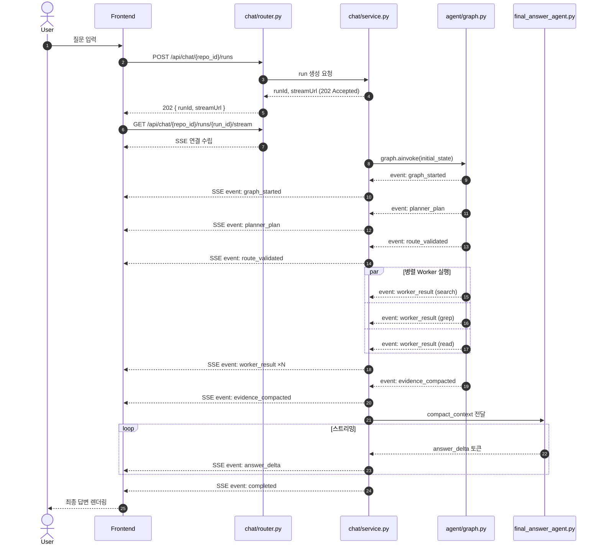
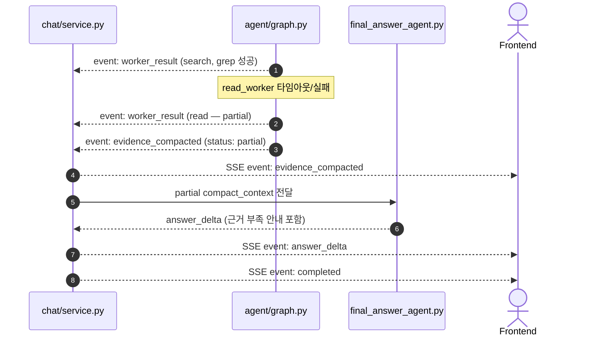

# LLM Chat Run API 명세서

> **도메인**: LLM | **범위**: Run Create / SSE Stream | **최종 업데이트**: 2026-06-25

## LLM-CHAT-API-001 멀티에이전트 채팅 실행 요청

### 기본 정보

| 항목 | 값 |
| --- | --- |
| Endpoint | `POST /api/chat/{repo_id}/runs` |
| Method | POST |
| 관련 기능 ID | `LLM-CHAT-B-101`, `LLM-CHAT-B-201`, `LLM-GRAPH-B-201`, `LLM-PLANNER-B-201` |
| 목적 | 사용자 질문을 받아 LangGraph 멀티에이전트 run을 생성하고 SSE stream URL을 반환 |
| 상태 | 구현 완료 |

### 요청

#### Path Parameters

| 파라미터명 | 타입 | 필수 | 설명 |
| --- | --- | --- | --- |
| `repo_id` | UUID | Y | 질문 대상 저장소 ID |

#### Request Body

| 필드명 | 타입 | 필수 | 기본값 | 설명 |
| --- | --- | --- | --- | --- |
| `question` | String | Y | - | 사용자 자연어 질문 |
| `sessionId` | UUID | N | auto | 기존 대화 세션에 이어서 질문할 때 사용 |
| `clientRequestId` | String | N | auto | Issue #173: 중복 submit 방지/idempotency 추적용 클라이언트 요청 ID |
| `mode` | String | N | `standard` | `lite`, `standard`, `deep` |
| `includeEvidence` | Boolean | N | true | 최종 응답에 evidence metadata 포함 여부 |
| `maxToolCalls` | Integer | N | 8 | 전체 worker tool call 최대 횟수 |
| `timeoutSeconds` | Integer | N | 30 | run 전체 timeout |
| `targetFiles` | String[] | N | [] | Issue #172: 사용자가 질문에 첨부한 repo 내부 상대 파일 경로 목록 |

#### 요청 예시

```http
POST /api/chat/8cfd0f7b-3ec3-42e3-97c4-8f4b4cc9390f/runs HTTP/1.1
Host: localhost:8000
Content-Type: application/json
Authorization: Bearer {access_token}

{
  "question": "로그인 로직 어딨어?",
  "clientRequestId": "chat-submit-20260626-001",
  "mode": "standard",
  "includeEvidence": true,
  "maxToolCalls": 8,
  "timeoutSeconds": 30,
  "targetFiles": ["backend/app/auth/router.py"]
}
```

### 응답

#### 성공 응답 - 202 Accepted

| 필드명 | 타입 | 설명 |
| --- | --- | --- |
| `code` | Integer | HTTP 상태 코드 |
| `message` | String | `accepted` |
| `data.runId` | UUID | 생성된 agent run ID |
| `data.sessionId` | UUID | 대화 세션 ID |
| `data.clientRequestId` | String | 요청에 사용된 클라이언트 요청 ID |
| `data.status` | String | `queued` 또는 `running` |
| `data.streamUrl` | String | SSE endpoint |
| `data.statusUrl` | String | 상태 조회 endpoint |
| `data.evidenceUrl` | String | evidence 조회 endpoint |
| `data.targetFiles` | String[] | 검증 후 run에 연결된 첨부 파일 경로 목록 |

#### 응답 예시

```json
{
  "code": 202,
  "message": "accepted",
  "data": {
    "runId": "2f86a7b7-4d9b-45f1-bc5b-1c2b938c1d10",
    "sessionId": "a0de8d29-92a4-4fd6-a657-2d22f4c0cc75",
    "clientRequestId": "chat-submit-20260626-001",
    "status": "queued",
    "streamUrl": "/api/chat/8cfd0f7b-3ec3-42e3-97c4-8f4b4cc9390f/runs/2f86a7b7-4d9b-45f1-bc5b-1c2b938c1d10/stream",
    "statusUrl": "/api/chat/8cfd0f7b-3ec3-42e3-97c4-8f4b4cc9390f/runs/2f86a7b7-4d9b-45f1-bc5b-1c2b938c1d10",
    "evidenceUrl": "/api/chat/8cfd0f7b-3ec3-42e3-97c4-8f4b4cc9390f/runs/2f86a7b7-4d9b-45f1-bc5b-1c2b938c1d10/evidence",
    "targetFiles": ["backend/app/auth/router.py"]
  }
}
```

### 에러 응답

| HTTP Status | Error Code | 발생 시점 | 설명 |
| --- | --- | --- | --- |
| 400 | `INVALID_CHAT_REQUEST` | body 검증 | 질문 누락, mode 오류, 옵션 상한 초과 |
| 400 | `INVALID_TARGET_FILE` | 첨부 파일 검증 | path traversal, 절대 경로, 빈 경로 |
| 401 | `UNAUTHORIZED` | 인증 검증 | 토큰 누락 또는 만료 |
| 403 | `TEAM_ACCESS_DENIED` | 권한 검증 | Phase 2: 팀 공유 repo의 active member가 아님 |
| 403 | `PRIVATE_RESOURCE_DENIED` | 권한 검증 | Phase 2: 다른 사용자의 private repo/chat 접근 |
| 404 | `REPO_NOT_FOUND` | repo 조회 | 저장소 없음 |
| 404 | `TARGET_FILE_NOT_FOUND` | 첨부 파일 검증 | repo workspace 또는 분석 결과에 없는 파일 |
| 409 | `DUPLICATE_CHAT_RUN` | 중복 submit 검증 | 같은 `clientRequestId` 또는 동일 질문 run이 이미 생성/진행 중 |
| 409 | `REPO_NOT_ANALYZED` | 사전 검증 | 분석/임베딩 미완료 |
| 500 | `LLM_RUN_CREATE_FAILED` | run 생성 | run 생성 실패 |

### Issue #173 404/409 방어 계약

- 프론트는 `repo_id`를 현재 선택된 completed analysis job에서 가져와야 하며, 임의 문자열이나 GitHub repository ID를 사용하지 않습니다.
- run 생성 성공 후에는 응답의 `streamUrl`, `statusUrl`, `evidenceUrl`을 사용합니다. legacy path를 조합해 호출하지 않습니다.
- 분석 job이 존재하지 않으면 404 `REPO_NOT_FOUND`, 분석/임베딩이 끝나지 않았으면 409 `REPO_NOT_ANALYZED`를 반환합니다.
- 같은 submit에 대해 `clientRequestId`가 중복되면 새 run을 만들지 않고 409 `DUPLICATE_CHAT_RUN` 또는 기존 run 정보를 반환하는 idempotent 정책 중 하나로 통일합니다.
- 사용자가 빠르게 두 번 전송해도 프론트는 submit lock을 걸고, 백엔드는 `clientRequestId`로 한 번 더 방어합니다.

### targetFiles 처리 계약

Issue #170, #172에 따라 `targetFiles`는 채팅 입력 UI, 사용자 메시지 렌더링, backend run context가 공유하는 단일 source of truth입니다.

- 프론트는 파일 칩의 `x` 버튼을 누르면 `targetFiles` 배열에서 해당 경로를 제거한 뒤 run 요청을 보냅니다.
- 사용자 메시지 저장/렌더링은 전송 시점의 `targetFiles` snapshot을 사용합니다.
- 백엔드는 검증된 `targetFiles`만 run/session metadata에 저장하고 agent context에 전달합니다.
- `targetFiles`는 repo 내부 상대 경로만 허용하며, `PROJECT-REPO-API-010`의 파일 path 검증 정책을 재사용합니다.

---

## LLM-CHAT-API-002 멀티에이전트 SSE 스트림

### 기본 정보

| 항목 | 값 |
| --- | --- |
| Endpoint | `GET /api/chat/{repo_id}/runs/{run_id}/stream` |
| Method | GET |
| 관련 기능 ID | `LLM-CHAT-B-203`, `LLM-OPS-B-201`, `LLM-OPS-B-202`, `LLM-OPS-B-204` |
| 목적 | LangGraph 실행 과정과 Final Answer 토큰을 SSE로 실시간 전달 |
| 상태 | 구현 완료 |

### 요청

#### Headers

| 헤더명 | 값 | 필수 | 설명 |
| --- | --- | --- | --- |
| `Accept` | `text/event-stream` | Y | SSE stream 수신 |
| `Authorization` | `Bearer {access_token}` | Y | 인증 토큰 |

### SSE 이벤트 예시

```text
event: graph_started
data: {"runId":"2f86a7b7-4d9b-45f1-bc5b-1c2b938c1d10","stateKeys":["user_query"]}

event: planner_plan
data: {"rewrittenQuery":"login signin auth authentication","selectedWorkers":["search","grep","read"],"allowedPaths":["backend/app","frontend/src"]}

event: route_validated
data: {"allowed":true,"parallelGroups":[["search","grep"],["read"]]}

event: worker_started
data: {"worker":"grep","target":"backend/app"}

event: worker_result
data: {"worker":"grep","resultCount":3,"evidenceIds":["ev_001","ev_002","ev_003"]}

event: evidence_compacted
data: {"evidenceCount":5,"compactContextReady":true}

event: no_evidence
data: {"reason":"no_search_results","message":"현재 저장소에서 질문과 관련된 코드를 찾지 못했습니다.","suggestedActions":["retry_with_keywords","attach_file"]}

event: answer_delta
data: {"content":"로그인 로직은 "}

event: references
data: {"items":[{"evidenceId":"ev_001","file":"backend/app/auth/router.py","lineStart":42,"lineEnd":58,"snippet":"@router.post('/login')"}]}

event: completed
data: {"runId":"2f86a7b7-4d9b-45f1-bc5b-1c2b938c1d10","status":"completed"}
```

### references 이벤트 계약

Issue #158, #161에 따라 `references` 이벤트는 답변 본문 citation, 근거 칩, 코드 프리뷰 line 이동이 공유하는 단일 근거 계약입니다.

| 필드명 | 타입 | 필수 | 설명 |
| --- | --- | --- | --- |
| items[].evidenceId | String | Y | worker/evaluator가 부여한 근거 ID |
| items[].file | String | Y | repo 내부 상대 파일 경로 |
| items[].lineStart | Integer \| null | N | 근거 시작 라인. 알 수 없으면 null |
| items[].lineEnd | Integer \| null | N | 근거 종료 라인. 알 수 없으면 null |
| items[].lineLabel | String | N | line 정보가 없을 때 `라인 미확인` 등 UI 표시값 |
| items[].snippet | String | N | 짧은 미리보기 코드 |
| items[].score | Number | N | 검색/평가 점수 |

`lineStart`/`lineEnd`가 없을 때는 0 또는 1을 임의로 넣지 않습니다. 프론트는 line 값이 null이면 파일만 열고 라인 하이라이트를 생략합니다.

### no_evidence 이벤트 계약

Issue #171에 따라 RAG 검색 결과가 없는 상태는 실패 이벤트와 분리합니다.

| 필드명 | 타입 | 필수 | 설명 |
| --- | --- | --- | --- |
| reason | String | Y | `no_search_results`, `low_confidence`, `filtered_by_policy` 등 |
| message | String | Y | 사용자에게 보여줄 친화적 안내 문구 |
| suggestedActions | String[] | N | `retry_with_keywords`, `attach_file`, `ask_general_followup` 등 |

프론트는 `no_evidence`를 받으면 failed UI가 아니라 empty state를 렌더링합니다. 일반 지식 fallback은 사용자가 명시적으로 선택한 follow-up run에서만 수행합니다.

### 연동 흐름 다이어그램

API-001(run 생성)과 API-002(SSE stream) 연동 흐름을 시퀀스 다이어그램으로 표현합니다.

#### 정상 흐름 (Happy Path)



#### Worker 실패 시 Partial Evidence 흐름



### 에러 응답

| HTTP Status | Error Code | 발생 시점 | 설명 |
| --- | --- | --- | --- |
| 401 | `UNAUTHORIZED` | 인증 검증 | 토큰 누락 또는 만료 |
| 403 | `TEAM_ACCESS_DENIED` | 권한 검증 | Phase 2: run 대상 repo 또는 thread에 접근 권한 없음 |
| 404 | `LLM_RUN_NOT_FOUND` | run 조회 | run 없음 |
| 409 | `RUN_REPO_MISMATCH` | run/repo 검증 | run은 존재하지만 path의 `repo_id`와 연결되지 않음 |
| 409 | `LLM_RUN_ALREADY_FINISHED` | 상태 검증 | 이미 완료/실패/취소된 run에 재스트림 또는 취소 요청 |
| 500 | `AGENT_STREAM_FAILED` | stream 처리 | stream 초기화 또는 전송 실패 |

---

### 📅 [2026-07-07] 프로젝트 종료 후 유지보수 단계 규칙 변경

> **적용 배경**: 공식 프로젝트 개발 기간 종료에 따라 개별 개선 및 기능 추가를 위한 명세서 수정시 아래 내용에 따라 변경 내역을 하위에 작성합니다.

- **공통 사항**
  - **내용**: 작성 전 시작에 날짜를 작성
- **1. API 명세서 추가**
  - **작성 방법**: 하단 로그 영역에 API ID와 사유를 먼저 기재한 뒤, 상위 본문에 신규 명세를 반영
- **2. API 명세서 수정**
  - **작성 방법**: 하단 로그에 수정 전 원본 명세와 사유를 먼저 보존 처리한 뒤, 상위 본문에 수정을 반영
    * *참고*: 원본 명세는 상위 도메인 대제목(##)부터 복제하되, 직접 수정하지 않는 하위 영역은 '생략'으로 대체 기재 가능
- **3. API 명세서 제거**
  - **작성 방법**: 하단 로그에 제거 직전의 원본 명세 전체와 사유를 먼저 보존 처리한 뒤, 상위 본문에서 해당 명세를 삭제
    * *참고*: API 전체 제거 시에는 상위 도메인 대제목(##)부터 전체 복제하며, 일부 정보만 부분 제거 시에는 해당 API 식별 정보와 함께 삭제되는 부분 명세만 기록

---

### 📅 [2026-07-07] API 명세 변경 로그 (예시)

- **LLM-FEEDBACK-API-001** (API 명세서 추가)
  - **사유**: 사용자가 AI 답변 품질에 대한 만족도(Thumbs up/down 및 텍스트 코멘트)를 전송하고, 이를 RAG 파인튜닝 학습 데이터셋으로 안전하게 축적하기 위해 API 명세를 신규 추가합니다.
- **API 명세서 수정**
  - **수정 전 원본 명세**:
    ## LLM 멀티에이전트 API 명세서
    ### LLM-CHAT-API-003 Agent Run 상태 및 State 요약 조회
    #### 기본 정보
    (생략)
    #### 에러 응답
    | HTTP Status | Error Code | 발생 시점 | 설명 |
    | :--- | :--- | :--- | :--- |
    | 404 | `LLM_RUN_NOT_FOUND` | run 조회 | run_id가 존재하지 않음 |
  - **사유**: 세션 타임아웃 만료로 인해 삭제된 run 상태를 프론트엔드에 정확히 안내하기 위해, 기존의 일반적인 `404` 대신 `410 Gone` HTTP 상태 코드 및 `LLM_RUN_EXPIRED` 에러 응답 코드를 반환하도록 상세 예외 처리 명세를 수정합니다.
- **API 명세서 제거**
  - **제거 직전 원본 명세**:
    ## LEGACY
    ### LEGACY-PROGRESS-API-001 미사용 구버전 웹소켓 프로그레스 API
    #### 기본 정보
    | 항목 | 값 |
    | :--- | :--- |
    | Endpoint | `GET /api/ws/analysis/legacy/progress` |
    | Method | GET / WebSocket |
    | 목적 | 구버전 웹소켓 분석 진행도 구독 엔드포인트 |
    | 상태 | 폐기 완료 |
  - **사유**: 실시간 진행률 알림이 SSE(Server-Sent Events) 프로토콜로 통합 일원화됨에 따라 더 이상 사용되지 않는 구버전 레거시 웹소켓 프로그레스 API 명세 구조를 영구 제거합니다.

---
