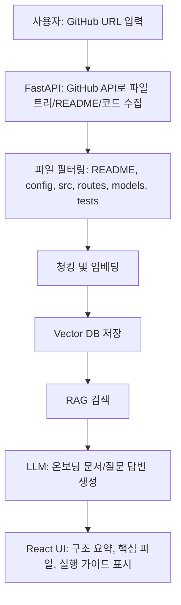

<!-- Converted from Notion HTML export: 프로젝트 기초 문서 7bdcc46ed95482afa0af01be35049829.html -->

🤔

# 프로젝트 기초 문서

---

LLM을 이용한 Application 개발

[프로젝트 주제 후보 (1)](https://app.notion.com/p/1-1b2cc46ed95483af8331011694131b79?pvs=21)

AI 코드베이스 온보딩 도우미 — GitHub 레포 분석 RAG 서비스

한 줄 요약

GitHub 레포 URL을 입력하면 README, 폴더 구조, 핵심 파일, 실행 방법, 처음 읽을 순서를 분석해서 "신입 개발자용 온보딩 문서"를 자동 생성하는 FastAPI + React 기반 LLM 웹앱.

## 1. 프로젝트 개요

| 항목 | 내용 |
| --- | --- |
| 프로젝트명 | (가칭) RepoPilot / Codebase Guide |
| 핵심 콘셉트 | 처음 보는 GitHub 레포를 빠르게 이해하도록 구조 분석, 핵심 파일 추천, 실행 가이드, 아키텍처 요약 제공 |
| 타깃 사용자 | 신입 개발자, 팀 프로젝트 참여자, 오픈소스 기여자, 부트캠프 수강생 |
| 스택 | React 또는 Next.js · FastAPI · GitHub API · RAG · LLM · PostgreSQL/pgvector 또는 Chroma |

## 2. 문제 정의 — 왜 필요한가

- 처음 보는 레포는 README만으로 전체 구조를 이해하기 어렵다.

- 팀 프로젝트에서 "어떤 파일부터 봐야 하는지", "어떻게 실행하는지", "핵심 로직이 어디 있는지" 찾는 데 시간이 많이 든다.

- 단순 챗봇이 아니라 실제 개발자가 바로 쓸 수 있는 온보딩/문서화 도구로 제품성이 있다.

## 3. 핵심 기능

MVP 기준 핵심 기능을 실제 개발 단위로 쪼개면 아래와 같다. 기능 영역은 크지만, 세부 기능과 구현 방법을 기준으로 역할 분담과 1주차 작업 범위를 정할 수 있다.

| 기능 영역 | 세부 기능 / 파생 기능 | 설명 | 구현 방법 |
| --- | --- | --- | --- |
| 레포 등록 | GitHub URL 검증, owner/repo/branch 추출, 분석 상태 생성 | 사용자가 public GitHub 레포 URL을 입력하면 분석 작업을 시작하고 레포 메타데이터를 저장한다. | FastAPI POST /api/repositories/analyze에서 URL 파싱 후 GitHub API로 접근 가능 여부 확인, repositories 테이블에 status=processing 저장 |
| 코드 수집 | clone/API 수집, 파일 크기 제한, 확장자 필터링 | README, 설정 파일, 주요 소스코드처럼 온보딩에 필요한 파일만 수집하고 node\_modules, build 산출물, 대용량 바이너리는 제외한다. | git clone --depth 1 또는 GitHub Contents API 사용, allowlist/denylist 기반 필터, max file size와 max file count 제한 적용 |
| 구조 분석 | 파일 트리 생성, 기술 스택 추론, 진입점 탐지 | 프로젝트가 어떤 프레임워크와 런타임을 쓰는지, 주요 폴더가 어떤 역할인지 자동으로 요약한다. | package.json, requirements.txt, pyproject.toml, Dockerfile, docker-compose.yml, framework config 파일을 규칙 기반으로 탐지 |
| 청킹 및 인덱싱 | 문서/코드 청크 생성, 메타데이터 저장 | RAG 검색을 위해 파일 내용을 검색 가능한 단위로 나누고 파일 경로, 언어, 라인 번호, 심볼 정보를 함께 저장한다. | MVP에서는 Markdown 헤더/문단 단위와 코드 파일 단위 분할을 우선 적용하고, 함수/클래스 단위 분할은 가능한 언어부터 점진 적용 |
| 임베딩 및 벡터 검색 | 임베딩 생성, repository\_id 기반 검색, top-k 검색 | 질문과 관련 있는 코드/문서 조각을 의미 기반으로 찾는다. | OpenAI embedding 모델과 pgvector 또는 Chroma 사용, chunks 테이블/컬렉션에 repository\_id, path, chunk\_type, start\_line, end\_line 저장 |
| 온보딩 문서 생성 | 프로젝트 요약, 처음 읽을 순서, 실행 가이드, 핵심 파일 목록 | 분석이 끝나면 신입 개발자가 바로 볼 수 있는 온보딩 문서를 자동 생성한다. | 파일 요약 -> 폴더 요약 -> 프로젝트 요약 순서의 Map-Reduce 방식으로 생성하고, 정해진 Markdown 템플릿에 맞춰 결과 저장 |
| Repo 기반 Q&A | 자연어 질문, 관련 코드 검색, 답변 생성 | 사용자가 “로그인 로직 어디야?”처럼 질문하면 실제 레포 내용을 근거로 답변한다. | POST /api/repositories/{repo\_id}/ask에서 질문 임베딩 -> top-k 검색 -> source 포함 프롬프트 구성 -> LLM 답변 생성 |
| Agentic Search | 다단계 질문, 추가 파일 탐색, 자가 교정 | 단순 검색 한 번으로 부족한 질문은 파일 트리, grep, 파일 읽기 도구를 제한된 범위에서 추가 실행한다. | 1차 RAG 결과의 신뢰도가 낮거나 질문이 복합적이면 tool loop 실행, 최대 5회 또는 20초 제한으로 비용과 지연 방지 |
| 답변 근거 표시 | 파일 경로, 라인 번호, 근거 요약, source card | 답변이 어떤 파일과 코드 조각을 기반으로 만들어졌는지 보여줘 hallucination을 줄이고 사용자가 직접 확인할 수 있게 한다. | chunk metadata의 path/start\_line/end\_line을 응답에 포함하고, UI에서 source list 또는 하이퍼링크 형태로 표시 |
| 분석 결과 저장 | 레포별 분석 문서, 질문 기록, 재조회 | 한 번 분석한 레포의 결과를 다시 볼 수 있게 저장해 팀 온보딩 문서로 재사용한다. | repositories, files, chunks, analyses, questions 테이블로 분리 저장하고 repo\_id 기준으로 문서/질문 기록 조회 |

## 4. 추가 기능

MVP의 기본 RAG 흐름이 완성된 뒤, 서비스 차별화와 답변 품질 개선을 위해 아래 기능을 추가 후보로 논의한다.

### 1) 텍스트 답변과 시각화 답변 탭 제공

- 답변을 텍스트로만 출력하지 않고, 필요에 따라 폴더 구조도, API 흐름도, 컴포넌트 관계도, 데이터 흐름도 같은 시각화 자료를 함께 제공한다.

- 다만 복사/붙여넣기와 문서화를 위해 텍스트 답변은 항상 유지하고, 텍스트 탭과 시각화 탭을 전환할 수 있게 한다.

### 2) 정보가 부족한 질문에 대한 추가 질문 기능

- 사용자 질문이 너무 넓거나 정보가 부족한 경우 바로 답변하지 않고, 추가 질문을 통해 의도를 명확히 한 뒤 답변한다.

- 추가 질문은 주관식만 제공하지 않고 객관식 선택지를 먼저 제시하며, 선택지에 없는 경우를 위해 기타 입력도 허용한다.

- 예: "이 프로젝트 어떻게 보면 돼?"라는 질문에는 전체 구조 파악, 실행 방법 파악, API 흐름 파악, 특정 기능 이해, 오류 수정 위치 찾기 등의 선택지를 제공한다.

### 3) 고도화된 의미 기반 청크 분할 헬퍼

- MVP의 기본 청킹 이후에는 RecursiveCharacterTextSplitter처럼 문자 수만 기준으로 자르기보다, 코드와 문서의 의미 단위를 더 정교하게 고려해 청크를 나눈다.

- Markdown은 제목/문단 단위로, 코드는 함수/클래스/라우터/컴포넌트 단위로 분할하고, 파일 경로·함수명·클래스명 같은 메타데이터를 함께 저장한다.

- 긴 문장이나 큰 코드 블록은 문맥이 끊기지 않도록 하위 문장/블록 단위로 재분할해 검색 정확도와 답변 품질을 높인다.

### 4) 얕은 분석 / 깊은 분석 진행 상태 표시

- GitHub URL을 입력하면 먼저 파일 트리, README, 설정 파일 중심의 얕은 분석을 빠르게 수행하고, 챗봇은 이 1차 분석 결과를 바탕으로 바로 대화를 시작한다.

- 동시에 백그라운드에서는 함수/클래스 단위 요약, 의존성 추적, Map-Reduce 문서화 같은 깊은 분석을 비동기 병렬 작업으로 계속 진행한다.

- UI에서는 얕은 분석과 깊은 분석을 분리한 프로그레스바 또는 단계 표시를 제공해 현재 어떤 수준까지 분석이 끝났는지 시각적으로 보여준다.

- 예를 들어 사용자가 심층 요약 보고서를 요청했지만 1차 분석만 끝난 상태라면, “현재는 1차 분석만 완료되어 심층 보고서는 아직 제공할 수 없습니다. 대신 지금 단계에서는 파일 트리 구조, 주요 파일의 목적, 프로젝트 실행 단서 정도는 정리해드릴 수 있습니다.”처럼 투명하게 안내한다.

- 깊은 분석이 완료되면 심층 보고서, 의존성 흐름, 핵심 로직 상세 설명처럼 더 무거운 요청을 처리할 수 있도록 하고, 필요하면 “2차 분석 완료 후 다시 요청해주세요” 또는 완료 알림을 제공한다.

- 구현은 analyze 요청 직후 repository 상태를 shallow\_done/deep\_processing/deep\_done처럼 나누고, 프론트엔드는 polling 또는 WebSocket/SSE로 진행률을 받아 프로그레스바와 챗봇 응답 정책에 반영한다.

## 5. 시스템 아키텍처



## 6. 프로젝트 디렉토리 구조

```
repo-pilot/
├── docker-compose.yml          # frontend / backend / postgres / vectordb
├── frontend/                   # React 또는 Next.js
│   ├── src/
│   │   ├── components/          # RepoForm, AnalysisPanel, SourceList, FileTree
│   │   ├── pages/               # 분석 목록, 상세 화면
│   │   ├── api/                 # FastAPI client
│   │   └── types/
│   └── package.json
├── backend/                    # FastAPI
│   ├── main.py
│   ├── api/
│   │   ├── repositories.py      # 레포 분석 요청/조회
│   │   └── ask.py               # repo 기반 Q&A
│   ├── services/
│   │   ├── github_client.py     # GitHub API 연동
│   │   ├── file_filter.py       # 분석 대상 파일 필터링
│   │   ├── analyzer.py          # 구조/실행법/핵심 파일 분석
│   │   └── llm.py               # LLM 호출
│   ├── rag/
│   │   ├── chunker.py
│   │   ├── embedder.py
│   │   ├── retriever.py
│   │   └── pipeline.py
│   ├── models/
│   │   ├── repository.py
│   │   ├── document_chunk.py
│   │   └── analysis.py
│   └── core/config.py
└── data/
    └── samples/                # 데모용 public repo 분석 샘플
```

## 7. API 설계

```
POST /api/repositories/analyze
요청: { "github_url": "<https://github.com/owner/repo>" }
응답: { "repo_id": 1, "status": "processing" }

GET /api/repositories/{repo_id}
응답: 레포 메타데이터, 분석 상태, 요약 결과

POST /api/repositories/{repo_id}/ask
요청: { "question": "백엔드 API 라우터 구조 설명해줘" }
응답: {
  "answer": "...",
  "sources": [{ "path": "backend/main.py", "reason": "FastAPI app entrypoint" }]
}
```

## 8. 레퍼런스

- `repositories/HarishChandran3304__TTG` — GitHub 레포를 대화형 분석 대상으로 만드는 FastAPI + React/Vite + Gemini 앱

- `repositories/aadhakal__code-review-ai` — 코드 분석/리뷰 UI 참고

- `repositories/vstorm-co__full-stack-ai-agent-template` — FastAPI + Next.js + RAG + streaming 구조 참고

- `repositories/BCG-X-Official__agentkit` — agent 기반 앱 구조 참고

- [codewiki.google.com](http://codewiki.google.com) - ***코드 저장소에 대한 문서를 자동으로 생성해주고, 구조를 시각화***하며, Gemini와 대화하듯 코드 설명

## 9. 난이도 / 리스크

- 종합 난이도: 중

- 장점: 발표 임팩트가 큼. FastAPI, React, GitHub API, RAG, LLM을 모두 보여줄 수 있음.

- 리스크: 큰 레포를 분석할 때 토큰/파일 수 제한이 필요함.

- 해결책: MVP에서는 public repo + 파일 수 제한 + 주요 확장자만 분석.

## 10. 프로젝트 이름 후보

- AskRepo AI

- RepoTalk AI

- CodeTalk AI

- RepoChat AI

- CodeChat AI

- CodeMap AI

- RepoMap AI

- Code Compass

- DevCompass

- GitPilot

- CodePilot

- RepoMate

- CodeMate

- GitMate

- DevMate

- RepoGuide

- CodeGuide

- RepoNavigator

- CodeNavigator

프로젝트 이름 제안

| 이름 | 한국어 어감 | 영어 어감 | 직관성 | 기억용이성 | 프로젝트 성격 반영 | 차별성 | 총평 |
| --- | --- | --- | --- | --- | --- | --- | --- |
| **AskRepo AI** | “레포에 물어본다”가 바로 이해됨 | 자연스럽고 짧음 | 5 | 5 | 4 | 3 | Q&A 기능은 매우 잘 드러나지만 온보딩/분석보다 질문 서비스 느낌이 강함 |
| **RepoTalk AI** | 레포와 대화한다는 느낌 | 부드럽고 서비스명 같음 | 4 | 5 | 3 | 3 | 친근하지만 챗봇 이미지가 강함 |
| **CodeTalk AI** | 코드와 대화한다는 의미가 쉬움 | 자연스러움 | 4 | 5 | 3 | 3 | 범용 코드 챗봇처럼 보여 레포 온보딩 특화성이 약함 |
| **RepoChat AI** | 레포 챗봇 느낌 | 매우 직관적 | 5 | 4 | 3 | 2 | 기능은 바로 보이지만 너무 챗봇 중심으로 들림 |
| **CodeChat AI** | 코드 챗봇 느낌 | 흔한 편 | 5 | 4 | 2 | 2 | 일반적인 코드 챗 서비스처럼 보임 |
| **CodeMap AI** | 코드 지도를 만든다는 느낌 | 짧고 제품명 같음 | 4 | 5 | 5 | 4 | 구조 분석/파일 탐색 성격이 잘 맞음 |
| **RepoMap AI** | 레포 지도를 만든다는 느낌 | 간결함 | 4 | 5 | 5 | 4 | GitHub 레포 분석 서비스라는 범위가 CodeMap보다 명확함 |
| **Code Compass** | 코드 나침반, 방향 안내 느낌 | 세련되고 안정적 | 4 | 4 | 5 | 4 | 온보딩/탐색/가이드 성격이 잘 살아남 |
| **DevCompass** | 개발자 나침반 느낌 | 자연스럽고 브랜드감 있음 | 3 | 4 | 4 | 4 | 개발자 도구 느낌은 좋지만 레포 분석이 직접 드러나진 않음 |
| **GitPilot** | Git을 조종/안내한다는 느낌 | 강하고 개발자스러움 | 4 | 5 | 4 | 4 | 이름은 좋지만 Git 자체 기능 도구로 오해될 수 있음 |
| **CodePilot** | 코드 작업을 안내하는 느낌 | 익숙하고 강함 | 4 | 5 | 4 | 3 | 좋은 이름이지만 Copilot 연상과 범용성 때문에 특화성이 약간 흐림 |
| **RepoMate** | 레포를 같이 봐주는 동료 느낌 | 친근하고 짧음 | 4 | 5 | 4 | 4 | 온보딩 도우미 이미지가 좋고 부담 없음 |
| **CodeMate** | 코드 동료 느낌 | 자연스럽고 친근함 | 4 | 5 | 3 | 3 | 범용 개발 보조 도구처럼 보임 |
| **GitMate** | Git 동료 느낌 | 짧고 귀여움 | 3 | 5 | 3 | 3 | Git 명령/브랜치 도구로 오해될 수 있음 |
| **DevMate** | 개발자 동료 느낌 | 친근함 | 3 | 5 | 3 | 3 | 넓은 개발 보조 서비스 느낌, 레포 분석 특화성은 약함 |
| **RepoGuide** | 레포 길잡이 느낌 | 매우 명확함 | 5 | 4 | 5 | 3 | 기능 설명력 최고. 다만 브랜드명으로는 조금 평범함 |
| **CodeGuide** | 코드 길잡이 느낌 | 자연스럽고 안정적 | 4 | 4 | 4 | 3 | 무난하지만 범용 코드 학습/문서 서비스처럼 보일 수 있음 |
| **RepoNavigator** | 레포 탐색기/길찾기 느낌 | 의미가 정확함 | 5 | 3 | 5 | 4 | 프로젝트 성격은 잘 맞지만 이름이 길어서 기억성은 낮음 |
| **CodeNavigator** | 코드 탐색기 느낌 | 전문적이고 명확함 | 4 | 3 | 4 | 4 | 구조 탐색 도구 느낌이 좋지만 다소 길고 무거움 |

최종 채택 : CodeMap

프로젝트 핵심 기능

코어 기능 및 설명

**프로젝트 등록 (Git 클론 및 필터링)**

- **기능 개요**

  - 사용자가 입력한 Git 저장소의 소스코드를 실시간으로 안전하게 복제하고 분석에 필요한 정보만 걸러내어 저장하는 초기 단계

- **핵심 가치 및 UX 디자인**

  1. **원클릭 저장소 연동**

     - 사용자는 별도의 개발 환경 세팅 없이 브라우저 화면에서 분석하고자 하는 GitHub URL만 입력하고 클릭하면 자동으로 코드가 복제됩니다.
       → Repository를 서버 Dir 안에 실시간 저장\* (경로 설정 → git clone 실행)

  2. **지능형 노이즈 필터링**

     - (필터링) 라이브러리 파일(`node_modules`, `.venv`), 빌드 산출물(`dist`, `build`), 컴파일러 캐시, 패키지 잠금 파일(`package-lock.json`, `poetry.lock`), 대용량 미디어 파일 및 바이너리(이미지, PDF) 등 코드 분석과 상관없는 노이즈를 자동으로 걸러냅니다.

     - (살리기) 프로젝트 환경설정 파일(예: `.env`, `package.json`, `requirements.txt`) 및 안내 문서(예: `README.md`)는 신규 개발자를 위한 온보딩 대시보드 및 구동 가이드 생성에 필수적이므로 제외하지 않고 안전하게 보존한다.

  **결론)** 분석 효율 극대화

  - 노이즈 필터링 → 시스템 처리 속도 비약적으로 단축, Agent가 오직 순수한 비즈니스 로직, 설계 문서에만 100% 집중해 답변 품질 높일 수 있게 한다.

**코드 맥락 및 관계망 이해 (RAG 및 코드 임베딩)**

- **기능 개요**

  - 단순 단어 비교 검색(Keyword Search)의 한계를 뛰어넘어, 코드가 갖는 고유한 역할과 설계 의미, 그리고 파일 간의 연결 관계를 학습하여 '의미 기반 사전'을 구축하는 단계

- **핵심 가치 및 UX 디자인**:

  - **의미 단위 구조화**

    - 코드 → 줄 단위의 단순한 텍스트가 아닌 **클래스**, **함수**, **메서드** 등 실제 소프트웨어 기능 단위로 분할해 역할을 파악한다.

  - **유기적 관계망 지도 구축\***

    - 어떤 소스코드 파일이 다른 파일을 참조하고 있는지(의존성 및 가져오기(Import) 흐름)를 추적하여 유기적인 논리 지도를 구성한다.

  - **계층적 개념 탐색 - 상향식**

    - 상위 폴더(디렉토리) 구조로 갈수록 하위 세부 요약본들을 자연스럽게 압축하여 체계적인 지식 구조를 구축합니다.

  - **자연어 질문 해석**

    - 사용자가 특정 변수명이나 함수명을 기억하지 못하더라도 *"로그인 처리는 어느 부분에서 담당해?"*, *"결제 금액을 계산하는 과정을 설명해줘"*와 같이 평소 사용하는 언어로 질문하면, 시스템이 문맥을 이해하고 의도에 맞는 소스코드 파일을 정확히 찾아냅니다.

**자율 탐색형 AI 코드 분석 (Agentic Search 및 도구 호출) - Agent Chat**

- **기능 개요**

  - AI 비서가 사용자의 질문을 단 한 번만 조회해 답변을 기계적으로 내놓는 것이 아니라, 숙련된 소프트웨어 엔지니어처럼 스스로 계획을 세우고 디렉토리를 열어보며 답을 찾아내는 자율형 탐색 기능

- **핵심 가치 및 UX 디자인**

  - **자율 탐색 계획 수립**

    - 복잡한 다단계 질문을 받으면 스스로 질문의 의미를 분석한 후, *"디렉토리 구조 파악 -> 파일 검색 -> 소스코드 정독 -> 참조 파일 확인"* 순으로 논리적인 탐색 여정을 계획합니다.

  - **실시간 소스코드 추적**

    - 시스템에 구현된 코드 탐색 기능(도구)들을 주도적으로 실행하며 최적의 답변 단서를 찾습니다.

  - **자가 교정(Self-Correction) 프로세스 및 루프 한계 설정**

    - 첫 번째 탐색 과정에서 답을 찾지 못하거나 정보가 부족하다고 인지할 경우, 연계된 다른 파일 경로를 탐색하여 오류를 스스로 바로잡는 자가 검증을 진행합니다. 이때 무한 분석 루프에 빠져 답변이 지연되거나 불필요한 API 비용이 발생하는 것을 원천 방지하기 위해, AI 비서의 자율 탐색 도구 호출은 최대 5회, 처리 시간은 최대 20초로 제한합니다. 제한된 범위 내에서 최종 결론에 도달하지 못할 경우 수집된 정보를 최대로 종합하여 최선의 답변을 제공하고, 한계가 발생했음을 사용자에게 알립니다.

  - **명확한 출처 제공**

    - 최종 답변 시 분석의 근거가 된 소스코드 파일명과 줄 번호(Line Numbers)를 하이퍼링크 형태로 제공하여, 사용자가 직접 코드를 대조해 보며 결과를 즉각적이고 완벽하게 신뢰할 수 있게 합니다.

**계층형 프로젝트 가이드북 자동 생성 (Map-Reduce 요약) - 문서화**

- **기능 개요**

  - 수십만 줄의 낯설고 방대한 저장소 코드를 일일이 읽지 않아도, 한눈에 파악할 수 있는 고품질의 Markdown 형식 '프로젝트 가이드북'을 자동으로 집필해 주는 기능

- **핵심 가치 및 UX 디자인**

  - **상향식(Bottom-up) 정보 집필**

    - 개별 소스코드 파일의 요약을 먼저 작성하고(Map), 폴더별로 이 요약본들을 모아서 상위 설명을 작성한 뒤, 최종적으로 프로젝트 전체의 마스터 리포트로 융합(Reduce)하는 체계적인 요약 과정을 거칩니다.

  - **정보 누락 및 한계 돌파**

    - 많은 분량을 한 번에 분석할 때 나타나는 정보 유실이나 본문 생략 문제 없이, 모든 소스코드의 구조가 꼼꼼하고 완벽하게 설명서에 반영됩니다.

  - **아키텍처 전반의 시각화**

    - 저장소의 연동 작업이 완료됨과 동시에 폴더 구조 트리, 핵심 데이터 흐름, 환경별 구동 방법이 정리된 문서가 즉석에서 생성되므로 새로 팀에 합류한 멤버들의 온보딩 리소스를 획기적으로 줄여줍니다.

**🏗️Agentic RAG 및 CodeCompass 아키텍처 설계 논의 요약**

본 문서는 CodeCompass 프로젝트의 핵심 엔진을 설계하기 위해 AI 모델과 논의된 아키텍처 구상 및 기술적 결론을 정리한 문서입니다.

### **1. 정적 RAG vs Agentic CAG**

- **전통적 RAG**: 코드를 임베딩하여 벡터 DB에 넣고, 질문과 코사인 유사도가 높은 조각을 기계적으로 가져오는 방식 (단점: 문맥 파편화, 구조 파악 불가).

- **Agentic CAG**: LLM의 초거대 컨텍스트 윈도우를 바탕으로, AI 에이전트가 직접 탐색 도구(`grep`, 파일 읽기 등)를 호출하여 능동적으로 코드를 찾아보고 읽는 방식. 검색 실패 시 사전 학습된 개발 지식을 바탕으로 유력한 다음 키워드를 논리적으로 재검색(Self-Correction).

### **2. 궁극의 하이브리드: Agentic RAG**

거대한 레포지토리 환경에서 순수 에이전트 방식의 '느린 탐색 속도'를 극복하기 위해, 메인 LLM과 쌍을 이루는 임베딩 모델로 RAG DB를 구축한 뒤 이를 에이전트의 '도구(MCP)'로 쥐어주는 방식.

- 1단계: Vector DB 검색(MCP)을 통해 연관 파일 후보군을 1초 만에 좁힘.

- 2단계: 로컬 탐색 도구(MCP)를 통해 해당 파일 및 주변 구조를 정밀하게 분석.

### **3. 계층적 트리 RAG (Tree-Based RAG) 구성 방식**

실시간 파일 동기화를 배제하고 특정 시점의 정적(Static) 스냅샷을 분석하는 환경에서의 최적의 DB 구축 알고리즘.

- **상향식 요약 (Bottom-up Hierarchical Summarization)**

  - 개별 최하위 파일의 벡터를 생성.

  - 상위 디렉토리를 벡터화할 때 하위 벡터들을 수학적으로 평균 내면 안 됨 (의미 훼손). 반드시 하위 텍스트들을 모아 **LLM으로 자연어 요약을 생성한 뒤 그 요약본을 임베딩**해야 함.

- **구조화된 프롬프트 (Structured Prompting)**

  - 디렉토리 요약 시 하위 파일들을 마크다운(`언어`)으로 명확히 구획지어 LLM에 전달.

  - 단, 폴더가 너무 커서 컨텍스트 제한을 초과할 경우, 이어붙이기(순차 전송) 방식보다는 개별 파일 요약본을 만든 뒤 그 요약본들을 다시 합치는 방식 채택 권장.

### **4. 스파게티 코드 및 의존성(Dependency) 문제 해결**

폴더(물리적 계층)를 무시하는 코드 참조 관계를 DB에 올바르게 기록하는 방법.

- 의존성 관계는 수학적 '벡터'로 저장하면 부정확해짐. 반드시 **문자열 배열(Array) 형태의 메타데이터**로 저장하여 정확한 매칭(Exact Match) 필터링에 사용해야 함.

  - `imports`: 내가 참조하는 파일들의 경로 (합집합 연산 적용)

  - `imported_by`: 나를 참조하는 역방향 파일 경로 (Fan-in)

### **5. PostgreSQL (pgvector) 채택의 압도적 이점**

제안된 트리 구조 + 의존성 그래프 RAG를 구현하는 데 최적화된 데이터베이스.

- **관계형 연산의 힘**: 벡터 유사도 검색 결과와, 파일 간의 의존성(관계형 데이터)을 한 번의 SQL `JOIN`으로 결합하여 조회 가능.

- **재귀 쿼리 지원**: `WITH RECURSIVE` 문법을 사용해 깊이(Depth) 기반의 폴더 트리 탐색이 압도적으로 빠름.

- **JSONB 인덱싱**: 파일마다 가변적인 의존성 배열(`imports`) 데이터를 JSONB로 저장하고 고속으로 필터링 가능.

**🧠**CodeMap 프로젝트: OpenAI 모델 선택 및 아키텍처 매칭 근거

> **NOTE**
> 본 문서는 CodeMap 프로젝트(Agentic RAG 기반 소스코드 분석 시스템)의 핵심 엔진 구성을 위해 제안된 OpenAI 모델 조합(GPT-4o, text-embedding-3-large, GPT-4o-mini)의 타당성을 OpenAI 공식 문서 및 벤치마크 지표를 바탕으로 검증한 기술 검토 문서입니다.

---

### 1. 메인 에이전트 모델: `gpt-4o` (Agentic Search 및 판단 로직)

CodeMap의 지능(Brain) 역할을 수행하며, 직접 파일 시스템 도구를 호출하고 코드를 탐색하는 메인 에이전트로 `gpt-4o`를 채택해야 하는 객관적인 이유입니다.

#### 📌 공식적인 도구 호출(Function Calling) 최적화 및 병렬 처리

**객관적 근거**

OpenAI는 공식 릴리즈를 통해 GPT-4o가 외부 시스템 API와 상호작용하는 도구 호출(Function Calling)에 있어 기존 모델 대비 비약적으로 향상된 성능을 지니고 있음을 명시했습니다. 특히, 여러 개의 도구를 한 번의 응답으로 실행하는 \*\*병렬 도구 호출(Parallel Tool Calling)\*\*을 완벽히 지원합니다.

**프로젝트 매칭**

CodeMap은 제한 시간(20초) 및 제한 횟수(5회) 내에 `grep`, `tree` 등의 탐색 도구를 능동적으로 사용해야 합니다. GPT-4o의 검증된 병렬 도구 호출 능력은 Agentic RAG의 탐색 루프를 가장 빠르고 정확하게 완수할 수 있는 핵심 기술 기반이 됩니다.

**공식 참조 문서**

[Hello GPT-4o (OpenAI 공식 블로그)](https://openai.com/index/hello-gpt-4o/)

#### 📌 다단계 추론(Multi-step Reasoning) 우위

**객관적 근거**

업계의 다양한 에이전트 벤치마크(예: Hugging Face Agent Leaderboard)에서 GPT-4o는 복잡한 맥락을 이해하고 다단계 계획을 수립하는 영역에서 최상위권의 추론 점수를 기록하고 있습니다.

**프로젝트 매칭**

얽혀있는 스파게티 코드의 의존성 구조를 해석하고, 첫 번째 탐색 실패 시 논리적으로 다음 탐색 경로를 유추하는 "자가 교정(Self-Correction)" 과정을 수행하려면 가장 지능이 높은 모델이 필수적입니다.

---

### 2. 코드 임베딩 모델: `text-embedding-3-large` (RAG 및 pgvector 구축)

방대한 코드와 문서를 수학적 벡터 공간으로 변환하여 정밀 검색을 가능하게 하는 임베딩 모델로 `text-embedding-3-large`를 채택해야 하는 이유입니다.

#### 📌 MTEB 및 MIRACL 벤치마크 점수 압도적 1위

**객관적 근거**

2024년 1월에 발표된 공식 성능 평가에 따르면, 기존 세대인 `text-embedding-ada-002` 대비 검색 정확도가 획기적으로 상승했습니다.

- **MTEB (영어 텍스트 평가)**: `64.6%` (기존 61.0% 대비 상승)

- **MIRACL (다국어 정보 검색 평가)**: `54.9%` (기존 31.4% 대비 비약적 상승)

**프로젝트 매칭**

한국어로 작성된 주석 및 명세서(`README.md`)와 영문 소스코드가 혼재된 GitHub 환경에서 분석을 수행해야 합니다. 다국어 검색(MIRACL)에서 압도적인 점수를 획득한 이 모델은, 최대 3072차원의 세밀한 벡터를 통해 변수명 중복을 넘어선 "코드의 미묘한 의미적 차이"까지 정확히 찾아냅니다.

**공식 참조 문서**

[New embedding models and API updates (OpenAI 공식 블로그)](https://openai.com/index/new-embedding-models-and-api-updates/)

#### 📌 마트료시카 표현 학습(Matryoshka Representation Learning) 공식 지원

**객관적 근거**

해당 모델은 `dimensions` API 파라미터를 사용하여 모델의 차원을 줄이더라도(예: 3072차원 -> 1024차원) 임베딩의 핵심 정보력과 성능을 거의 그대로 유지하는 기능을 공식적으로 지원합니다.

**프로젝트 매칭**

PostgreSQL의 pgvector를 활용하는 CodeMap 환경에서, 향후 DB 저장 공간 절약이나 벡터 인덱스 쿼리 속도 최적화가 필요해질 경우, 검색 품질을 희생하지 않으면서도 시스템 부하를 줄일 수 있는 강력한 아키텍처적 유연성을 제공합니다.

---

### 3. 하이브리드 병행 모델: `gpt-4o-mini` (Map-Reduce 요약 파이프라인)

초기 데이터 구축 파이프라인에서 막대한 텍스트 처리를 담당하는 모델로 `gpt-4o-mini`를 병행 사용하는 '하이브리드 전략'을 채택해야 하는 이유입니다.

### 📌 압도적인 비용 효율성 (Cost Efficiency)

**객관적 근거**

GPT-4o-mini의 가격 정책은 입력 토큰 100만 개당 `$0.15`로, 이전 세대인 GPT-3.5 Turbo 대비 **60% 이상 저렴**하며, 메인 모델인 GPT-4o와 비교하면 입력 기준 **약 33배 저렴**한 공식 단가를 가집니다.

**프로젝트 매칭**

CodeMap의 4대 핵심 기능 중 "자동화된 문서화(Map-Reduce)" 단계는 전체 코드 파일을 수십 번 반복해서 읽고 병합해야 하므로 막대한 입력 토큰을 소모합니다. 시스템 유지 보수 및 운영 비용 절감을 위해 전처리 과정에 이 모델을 배치하는 것은 필수적인 전략입니다.

**공식 참조 문서**

[OpenAI API Pricing (공식 단가표)](https://openai.com/api/pricing/)

### 📌 소형 모델 중 최고 수준의 추론 능력 (MMLU)

**객관적 근거**

단순 언어 능력을 평가하는 MMLU 벤치마크에서 \*\*`82.0%`\*\*를 기록하여, 동급 경쟁 모델인 Gemini Flash(77.9%) 및 Claude Haiku(73.8%)를 공식적으로 앞서고 있습니다.

**프로젝트 매칭**

저렴하다고 해서 문해력이 떨어진다면 코드 요약의 품질을 보장할 수 없습니다. 하지만 GPT-4o-mini는 비용 대비 뛰어난 인지 능력을 공식 지표로 증명하였으므로, 백그라운드에서 하위 폴더와 파일들의 역할을 요약하고 관계망을 도출하는 작업에 충분하고도 넘치는 성능을 발휘합니다.

**공식 참조 문서**

[GPT-4o mini: advancing cost-efficient intelligence (OpenAI 공식 블로그)](https://openai.com/index/gpt-4o-mini-advancing-cost-efficient-intelligence/)

**🗄️**CodeCompass Agentic RAG & DB 스키마 최종 아키텍처

### 1. 정적 RAG와 Agentic CAG의 결합

전통적인 RAG의 문맥 파편화 단점을 보완하기 위해, 메인 LLM과 임베딩 모델을 쌍으로 구성하고 에이전트가 직접 파일 탐색을 능동적으로 호출하는 하이브리드 RAG 방식을 채택합니다. 검색 실패 시 사전 학습된 지식을 통해 능동적 재검색(Self-Correction)을 수행합니다.

### 2. 계층적 트리 RAG (Tree-Based RAG)

개별 최하위 파일의 텍스트를 임베딩하고, 상위 디렉토리는 하위 파일 텍스트들을 묶어 마크다운 구조화 프롬프트로 LLM에 넘겨 '요약본'을 추출한 뒤 그 요약본을 임베딩합니다 (Bottom-up 방식). 이로써 폴더 레벨의 넓은 범위의 문맥 질문에도 완벽하게 대응합니다.

### 3. PostgreSQL 기반 의존성 스키마 및 ERD

폴더 구조를 무시하는 스파게티 코드의 의존성 문제를 해결하기 위해, 의존 관계를 수학적 벡터(Embedding)가 아닌 명시적인 PostgreSQL 관계형 테이블(DEPENDENCY)로 분리 저장합니다. 유사도 검색(Vector Search)과 역방향 의존성 조회(SQL JOIN)를 동시에 실행하여 완벽한 방사형 지식 그래프를 구성합니다.

<https://apption.co/embeds/b68e588b>

✂️ AST 기반 의미론적 코드 청킹(Semantic Chunking) 전략

코드 분할 시 단순 글자 수(Character-based)로 자르는 기존 방식은 반복문이나 클래스 선언부를 절단하여 문맥 훼손을 초래합니다. 이를 방지하기 위해 `Tree-sitter` 등 구문 분석 파서(Parser)를 도입하여 클래스(Class)와 함수(Function) 등 논리적 완전성을 지닌 **AST(추상 구문 트리) 단위**로 분할(Chunking)합니다.

- **문법적 무결성 보존**: 클래스와 메서드의 경계를 정확히 인식하여 LLM에게 오염되지 않은 독립적이고 완전한 논리 단위(Chunk)를 제공합니다.

- **대용량 처리 (Stack & Pop 분할 전송)**: 디렉토리 단위의 거대한 텍스트를 처리할 때는 스택(Stack) 구조를 활용해 LLM 컨텍스트 한계(Token Limit) 직전에 Pop하고 분할 전송하여 중간 요약을 추출한 뒤, 최종 병합(Map-Reduce)하는 파이프라인을 구축합니다.

- **임베딩 모델 통합 전략**: 무상태(Stateless)인 임베딩 모델의 한계를 극복하기 위해, 분할 생성된 여러 개의 벡터들을 백엔드에서 평균 연산(Mean Pooling)하여 해당 디렉토리/파일을 대변하는 단일 대표 벡터로 압축 저장합니다.

### 📚 공식 출처 및 검증 링크

이 전략이 업계 표준(Gold Standard)임을 증명하는 공식 레퍼런스입니다.

- **[LlamaIndex: CodeSplitter Node Parser](https://docs.llamaindex.ai/en/stable/module_guides/loading/node_parsers/modules.html#codesplitter)**

  - **확인할 부분**: 문서 상단의 `CodeSplitter` 설명을 보시면, \*"Splits based on the syntax tree of the code... using tree-sitter"\*라고 명시되어 있습니다. 텍스트 분할이 아닌 구문 트리(AST) 기반 분할을 공식 지원함을 확인할 수 있습니다.

- **[LangChain: Split code](https://python.langchain.com/docs/modules/data_connection/document_transformers/code_splitter)**

  - **확인할 부분**: 문서 중간의 예시 코드를 보면 일반 문서와 다르게 `Language.PYTHON` 등을 명시하여 언어별 구문 특성을 살려 재귀적으로 분할하도록 가이드하고 있습니다.

- **[Tree-sitter Official Site](https://tree-sitter.github.io/tree-sitter/)**

  - **확인할 부분**: 메인 페이지의 "Robust" 및 "General-purpose" 섹션에서 코드가 수정되더라도 전체 AST 구조를 점진적 파싱(Incremental Parsing)하여 클래스/함수 경계를 정확히 유지하는 원리를 볼 수 있습니다.
